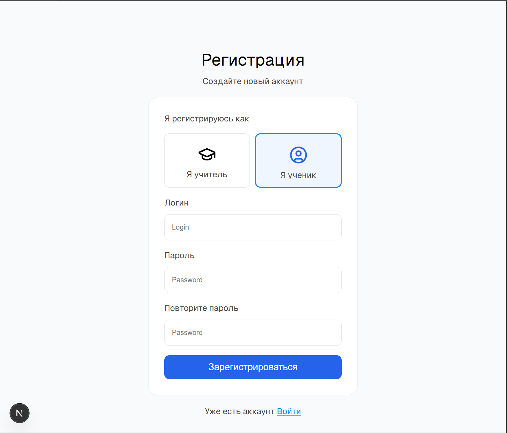
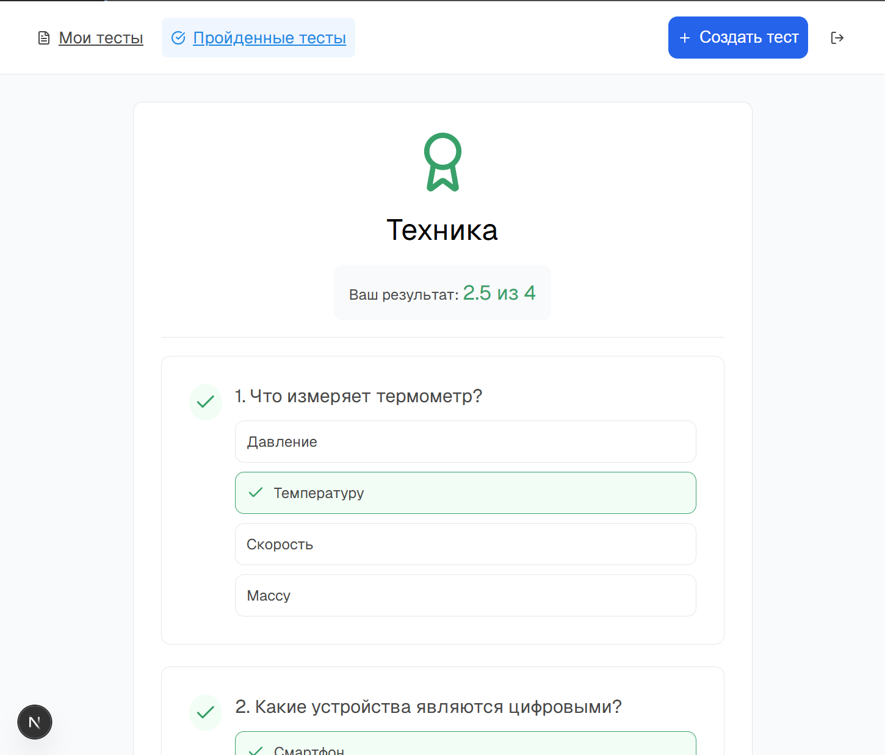
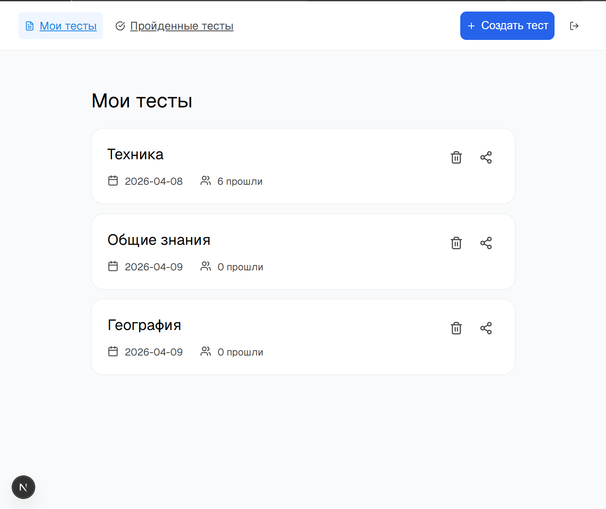

# Test Platform

Веб-приложение для создания и прохождения тестов с автоматической проверкой результатов, историей попыток и анализом ответов.

## Возможности

### Для преподавателя

- Создание тестов
- Выбор темы и количества вопросов
- Генерация теста из базы вопросов
- Загрузка файла с вопросами и автоматический парсинг в базу данных

### Для пользователя

#### Прохождение тестов

- Прохождение тестов
- Поддержка разных типов вопросов:
  - Одиночный выбор (radio)
  - Множественный выбор (checkbox)
  - Текстовый ответ

#### Проверка и оценка

- Автоматическая проверка ответов
- Частичные баллы за множественные ответы

#### Результаты

- Просмотр результатов
- Просмотр правильных ответов
- Анализ ошибок

## Стек технологий

### Frontend

- React
- Next.js
- TypeScript
- React Hook Form
- Yup (валидация)
- CSS Modules

### Backend

- Node.js
- Express
- Sequelize
- PostgreSQL

---

  
  
  

## Статус проекта

Проект находится в активной разработке. Некоторые функции могут быть доработаны или изменены.
